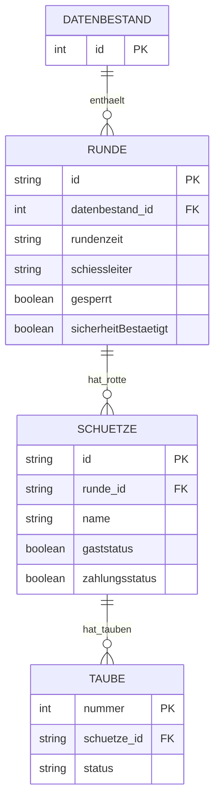

# Domain Model

```mermaid
erDiagram
    DATENBESTAND {
        int id PK
    }

    RUNDE {
        string id PK
        int datenbestand_id FK
        string rundenzeit
        string schiessleiter
        boolean gesperrt
        boolean sicherheitBestaetigt
    }

    SCHUETZE {
        string id PK
        string runde_id FK
        string name
        boolean gaststatus
        boolean zahlungsstatus
    }

    TAUBE {
        int nummer PK
        string schuetze_id FK
        string status
    }

    DATENBESTAND ||--o{ RUNDE : enthaelt
    RUNDE ||--o{ SCHUETZE : hat_rotte
    SCHUETZE ||--o{ TAUBE : hat_tauben
```
